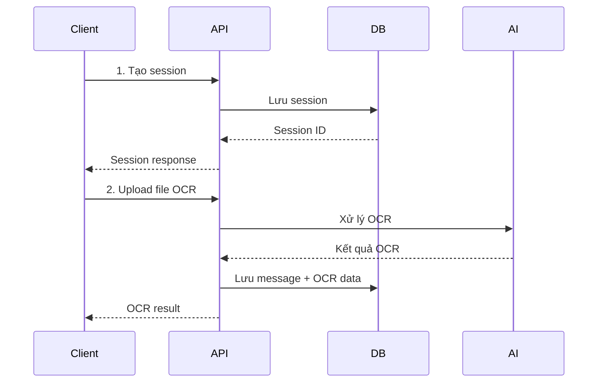
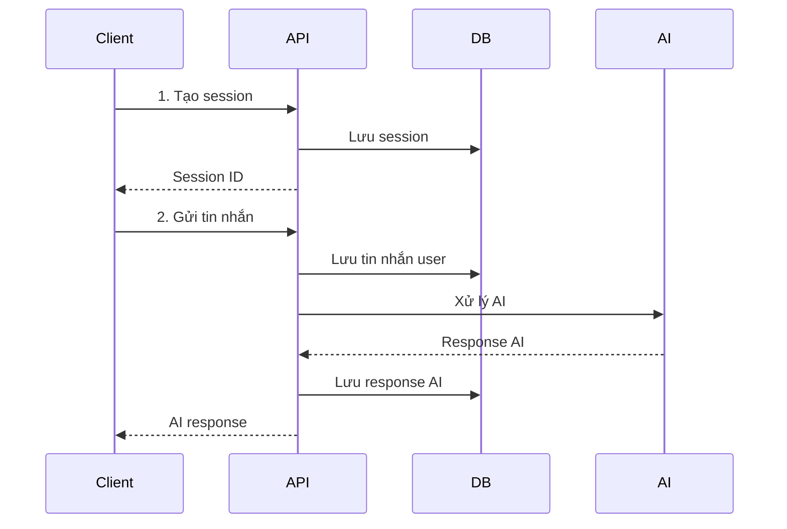

# API Integration Guide - Chat AI Backend

## Tổng Quan

Backend API cung cấp các tính năng chính:
- **Chat AI**: Quản lý session và tin nhắn với AI
- **OCR Expense**: Trích xuất thông tin hóa đơn từ hình ảnh
- **Transaction Management**: Quản lý thu/chi cá nhân
- **User Management**: Quản lý người dùng

**Base URL**: `http://localhost:8000`  
**API Version**: `/api/v1`  
**Documentation**: `http://localhost:8000/docs` (Swagger UI)

---

## 1. User Management

### 1.1 Tạo User Mới
```http
POST /api/v1/users/
Content-Type: application/json

{
  "email": "user@example.com",
  "password": "password123",
  "full_name": "User Name"
}
```

**Response (201)**:
```json
{
  "id": "3a1e7c5c-0a22-4f3f-9f2d-5e9a3a1b2c3d",
  "email": "user@example.com",
  "full_name": "User Name"
}
```

---

## 2. Chat AI Management

### 2.1 Tạo Session Chat
```http
POST /api/v1/chat/sessions?user_id={user_id}
```

**Response (200)**:
```json
{
  "id": "4f90dbed-a818-4376-8b2f-ac39a44bc6d1",
  "user_id": "3a1e7c5c-0a22-4f3f-9f2d-5e9a3a1b2c3d",
  "session_name": "Chat 2025-10-11 00:30",
  "created_at": "2025-10-11T00:30:00",
  "updated_at": "2025-10-11T00:30:00",
  "is_active": true
}
```

### 2.2 Lấy Danh Sách Sessions
```http
GET /api/v1/chat/sessions?user_id={user_id}
```

**Response (200)**:
```json
[
  {
    "id": "4f90dbed-a818-4376-8b2f-ac39a44bc6d1",
    "user_id": "3a1e7c5c-0a22-4f3f-9f2d-5e9a3a1b2c3d",
    "session_name": "Chat 2025-10-11 00:30",
    "created_at": "2025-10-11T00:30:00",
    "updated_at": "2025-10-11T00:30:00",
    "is_active": true
  }
]
```

### 2.3 Gửi Tin Nhắn Chat
```http
POST /api/v1/chat/
Content-Type: application/json

{
  "user_id": "3a1e7c5c-0a22-4f3f-9f2d-5e9a3a1b2c3d",
  "session_id": "4f90dbed-a818-4376-8b2f-ac39a44bc6d1",
  "query": "Xin chào!",
  "suggestion": false
}
```

**Response (200)**:
```json
{
  "answer": "Xin chào! Tôi có thể giúp gì cho bạn?",
  "suggestion": null,
  "session_id": "4f90dbed-a818-4376-8b2f-ac39a44bc6d1"
}
```

### 2.4 Lấy Lịch Sử Chat
```http
GET /api/v1/chat/history?session_id={session_id}&limit=20
```

**Response (200)**:
```json
[
  {
    "role": "user",
    "content": "Xin chào!"
  },
  {
    "role": "assistant", 
    "content": "Xin chào! Tôi có thể giúp gì cho bạn?"
  }
]
```

---

## 3. OCR Expense Extraction

### 3.1 Trích Xuất Thông Tin Hóa Đơn
```http
POST /api/v1/ocr/expense:extract
Content-Type: multipart/form-data

file: [binary file] (image/jpeg, image/png, image/heic, application/pdf)
session_id: 4f90dbed-a818-4376-8b2f-ac39a44bc6d1
user_id: 3a1e7c5c-0a22-4f3f-9f2d-5e9a3a1b2c3d
hints: (optional JSON string)
debug: false
```

**Response (200)**:
```json
{
  "job_id": "0e1b69fa-1789-4694-bb4a-6337928a699f",
  "session_id": "4f90dbed-a818-4376-8b2f-ac39a44bc6d1",
  "user_id": "3a1e7c5c-0a22-4f3f-9f2d-5e9a3a1b2c3d",
  "filename": "0825_vinmart5.jpg",
  "status": "completed",
  "created_at": "2025-10-11T00:47:38.239854",
  "result": {
    "transaction_date": "2018-10-26",
    "amount": {
      "value": 49200,
      "currency": "VND"
    },
    "category": {
      "code": "GRO",
      "name": "Tạp hoá/Siêu thị"
    },
    "items": [
      {
        "name": "Tân tân đậu vị tôm 90G T24",
        "qty": 1
      }
    ],
    "meta": {
      "needs_review": false,
      "warnings": []
    }
  }
}
```

**Lưu ý quan trọng**: 
- `session_id` phải tồn tại trong database (tạo session trước)
- Hỗ trợ file: JPEG, PNG, HEIC, PDF
- Kích thước tối đa: 5MB
- Kết quả OCR sẽ được lưu vào session context

---

## 4. Transaction Management

### 4.1 Tạo Giao Dịch
```http
POST /api/v1/transactions/
Content-Type: application/json

{
  "user_id": "3a1e7c5c-0a22-4f3f-9f2d-5e9a3a1b2c3d",
  "amount": 1500000,
  "type": "income",
  "category": "salary",
  "note": "Lương tháng 10",
  "occurred_at": "2025-10-01 09:00:00"
}
```

**Response (201)**:
```json
{
  "id": "abc123-def456-ghi789",
  "user_id": "3a1e7c5c-0a22-4f3f-9f2d-5e9a3a1b2c3d",
  "amount": 1500000.0,
  "type": "income",
  "category": "salary",
  "note": "Lương tháng 10",
  "occurred_at": "2025-10-01 09:00:00",
  "created_at": "2025-10-01T09:00:00"
}
```

**Lưu ý về thời gian**:
- Chỉ chấp nhận định dạng: `YYYY-MM-DD HH:MM:SS` (giờ Việt Nam)
- Ví dụ: `2025-10-08 14:30:45`

### 4.2 Lấy Tổng Thu/Chi
```http
GET /api/v1/transactions/summary?user_id={user_id}&start=2025-10-01 00:00:00&end=2025-11-01 00:00:00
```

**Response (200)**:
```json
{
  "income": 1500000.0,
  "expense": 500000.0,
  "net": 1000000.0
}
```

---

## 5. Luồng Logic Tích Hợp

### 5.1 Luồng OCR Expense Hoàn Chỉnh



**Các bước thực hiện**:

1. **Tạo User** (nếu chưa có)
2. **Tạo Session** cho user
3. **Upload file OCR** với session_id hợp lệ
4. **Xử lý kết quả** OCR (tự động lưu vào session)

### 5.2 Luồng Chat AI



---

## 6. Error Handling

### 6.1 HTTP Status Codes
- `200`: Success
- `201`: Created
- `400`: Bad Request
- `404`: Not Found
- `422`: Validation Error
- `500`: Internal Server Error

### 6.2 Error Response Format
```json
{
  "detail": "Error message",
  "type": "error_type"
}
```

### 6.3 Common Errors

**Session không tồn tại**:
```json
{
  "detail": "Session not found",
  "type": "session_error"
}
```

**File không hợp lệ**:
```json
{
  "detail": "Invalid file format",
  "type": "file_validation_error"
}
```

**Validation Error**:
```json
{
  "detail": [
    {
      "loc": ["body", "amount"],
      "msg": "ensure this value is greater than 0",
      "type": "value_error.number.not_gt"
    }
  ],
  "type": "validation_error"
}
```

---

## 7. Rate Limiting & Performance

- **OCR Processing**: ~10-15 giây cho file ảnh thông thường
- **Chat Response**: ~2-5 giây tùy độ phức tạp
- **File Upload**: Tối đa 5MB
- **Concurrent Requests**: Không giới hạn (tùy server capacity)

---

## 8. Testing & Development

### 8.1 Health Check
```http
GET /health
```

**Response**:
```json
{
  "status": "ok"
}
```

### 8.2 API Documentation
- **Swagger UI**: `http://localhost:8000/docs`
- **ReDoc**: `http://localhost:8000/redoc`

### 8.3 Test với cURL

**Tạo session**:
```bash
curl -X POST "http://localhost:8000/api/v1/chat/sessions?user_id=test-user" \
  -H "accept: application/json"
```

**Test OCR**:
```bash
curl -X POST "http://localhost:8000/api/v1/ocr/expense:extract" \
  -H "accept: application/json" \
  -H "Content-Type: multipart/form-data" \
  -F "file=@test-image.jpg;type=image/jpeg" \
  -F "session_id=your-session-id" \
  -F "user_id=test-user" \
  -F "debug=false"
```

---

## 9. Security & Authentication

- **CORS**: Enabled cho tất cả origins
- **Input Validation**: Pydantic schemas
- **File Upload**: Type validation + size limits
- **Database**: SQL injection protection via SQLAlchemy

---

## 10. Support & Contact

- **API Documentation**: `http://localhost:8000/docs`
- **Health Check**: `http://localhost:8000/health`
- **Logs**: Check container logs for debugging

---
